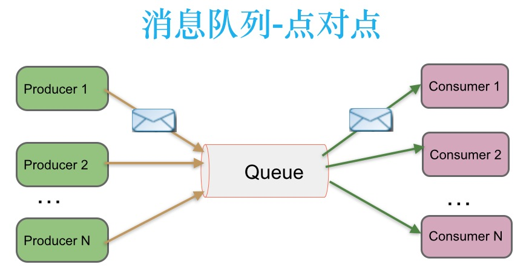
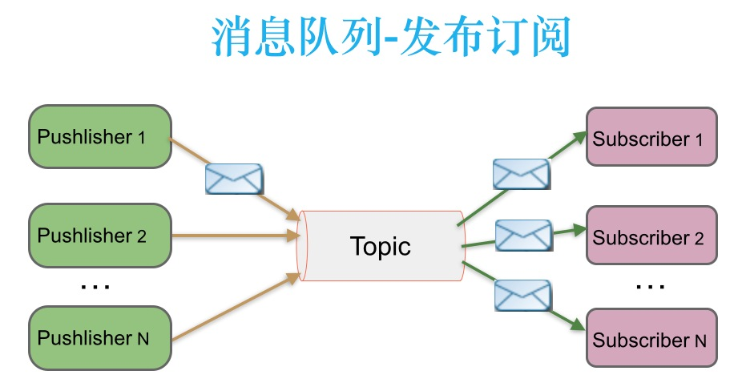

# Kafka 基础介绍

## 一、简介

kafka 是一个消息队列。消息队列最初被设计出来的目的是希望在我们数据库压力过大，且使用了缓存仍然解决不了问题的时候，希望由一个队列暂存请求，再由系统根据某种策略从队列中分批处理请求。

kafka 是由于 ActiveMq 无法满足需求，由 Linkedin 公司开源的一个 mq 系统，于 2010 年贡献给了 Apache 基金会并成为顶级开源项目。

主要应用场景是：日志收集系统和消息系统。

Kafka 主要设计目标如下：

-   以时间复杂度为 O(1)的方式提供消息持久化能力，即使对 TB 级以上数据也能保证常数时间的访问性能。
-   高吞吐率。即使在非常廉价的商用机器上也能做到单机支持每秒 100K 条消息的传输。
-   支持 Kafka Server 间的消息分区，及分布式消费，同时保证每个 partition 内的消息顺序传输。
-   同时支持离线数据处理和实时数据处理。
-   Scale out:支持在线水平扩展。

消息系统主要由两种消息传递模式：

-   点对点模式

-   发布-订阅模式

**在点对点消息系统中**，消息持久化到一个队列中。此时，将有一个或多个消费者消费队列中的数据。但是一条消息只能被消费一次。当一个消费者消费了队列中的某条数据之后，该条数据则从消息队列中删除。该模式即使有多个消费者同时消费数据，也能保证数据处理的顺序。这种架构描述示意图如下：

**生产者发送一条消息到 queue，只有一个消费者能收到**。

**在发布-订阅消息系统中**，消息被持久化到一个 topic 中。与点对点消息系统不同的是，消费者可以订阅一个或多个 topic，消费者可以消费该 topic 中所有的数据，同一条数据可以被多个消费者消费，数据被消费后不会立马删除。在发布-订阅消息系统中，消息的生产者称为发布者，消费者称为订阅者。该模式的示例图如下：

**发布者发送到 topic 的消息，只有订阅了 topic 的订阅者才会收到消息**。

## 二、术语解析

https://www.cnblogs.com/qingyunzong/p/9004509.html

### Broker

Kafka 集群包含一个或多个服务器，服务器节点称为 broker。

broker 存储 topic 的数据。如果某 topic 有 N 个 partition，集群有 N 个 broker，那么每个 broker 存储该 topic 的一个 partition。

如果某 topic 有 N 个 partition，集群有(N+M)个 broker，那么其中有 N 个 broker 存储该 topic 的一个 partition，剩下的 M 个 broker 不存储该 topic 的 partition 数据。

如果某 topic 有 N 个 partition，集群中 broker 数目少于 N 个，那么一个 broker 存储该 topic 的一个或多个 partition。在实际生产环境中，尽量避免这种情况的发生，这种情况容易导致 Kafka 集群数据不均衡。

### Topic

每条发布到 Kafka 集群的消息都有一个类别，这个类别被称为 Topic。（物理上不同 Topic 的消息分开存储，逻辑上一个 Topic 的消息虽然保存于一个或多个 broker 上但用户只需指定消息的 Topic 即可生产或消费数据而不必关心数据存于何处）

类似于数据库的表名

### Partition

topic 中的数据分割为一个或多个 partition。每个 topic 至少有一个 partition。每个 partition 中的数据使用多个 segment 文件存储。partition 中的数据是有序的，不同 partition 间的数据丢失了数据的顺序。如果 topic 有多个 partition，消费数据时就不能保证数据的顺序。在需要严格保证消息的消费顺序的场景下，需要将 partition 数目设为 1。

### Producer

生产者即数据的发布者，该角色将消息发布到 Kafka 的 topic 中。broker 接收到生产者发送的消息后，broker 将该消息**追加**到当前用于追加数据的 segment 文件中。生产者发送的消息，存储到一个 partition 中，生产者也可以指定数据存储的 partition。

### Consumer

消费者可以从 broker 中读取数据。消费者可以消费多个 topic 中的数据。

### Consumer Group

每个 Consumer 属于一个特定的 Consumer Group（可为每个 Consumer 指定 group name，若不指定 group name 则属于默认的 group）。

### Leader

每个 partition 有多个副本，其中有且仅有一个作为 Leader，Leader 是当前负责数据的读写的 partition。

### Follower

Follower 跟随 Leader，所有写请求都通过 Leader 路由，数据变更会广播给所有 Follower，Follower 与 Leader 保持数据同步。如果 Leader 失效，则从 Follower 中选举出一个新的 Leader。当 Follower 与 Leader 挂掉、卡住或者同步太慢，leader 会把这个 follower 从“in sync replicas”（ISR）列表中删除，重新创建一个 Follower。

## 三、kafka 设计思路

### 关键点

元数据存储、分区主从读写（包括 leader 选举）、producer 消息推送、consumer 拉取、节点通信、消息落盘、生产消费者以及主题分区间的关系设计、分区数据一致性

##参考文章

http://www.jasongj.com/2015/03/10/KafkaColumn1/
